# Sistem Informasi Manajemen RW 10

Sistem Informasi Manajemen RW 10 adalah aplikasi berbasis web yang dirancang untuk mempermudah pengelolaan data dan administrasi di lingkungan RW 10. Aplikasi ini menyediakan fitur lengkap untuk manajemen warga, keuangan, surat pengantar, bantuan sosial, dan inventaris aset.

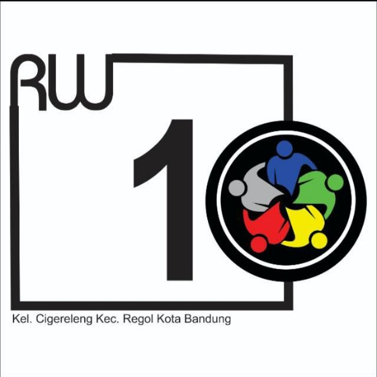

## Fitur Utama

-   **Manajemen Warga & KK**: Pencatatan lengkap data penduduk dan kartu keluarga.
-   **Keuangan & Transaksi**: Laporan keuangan transparan, pencatatan pemasukan/pengeluaran, dan kategori transaksi.
-   **Layanan Surat**: Pembuatan dan pencetakan surat pengantar otomatis.
-   **Tagihan & Tunggakan**: Manajemen iuran bulanan warga.
-   **Bantuan Sosial (Bansos)**: Pendataan program dan penerima bantuan sosial.
-   **Inventaris & Aset**: Peminjaman dan pendataan aset milik RW.
-   **Manajemen User**: Kontrol akses untuk Admin dan Pengurus RT.

---

## Galeri Aplikasi

### Halaman Utama (Homepage)
Talaman depan yang informatif dan modern untuk warga.
.png)

### Halaman Login
Halaman akses yang aman untuk administrator dan pengurus RW/RT.

---

### Tampilan Admin (Dashboard & Fitur)

#### 1. Dashboard Utama
Ringkasan statistik warga, keuangan, dan aktivitas terbaru dalam satu pandangan.
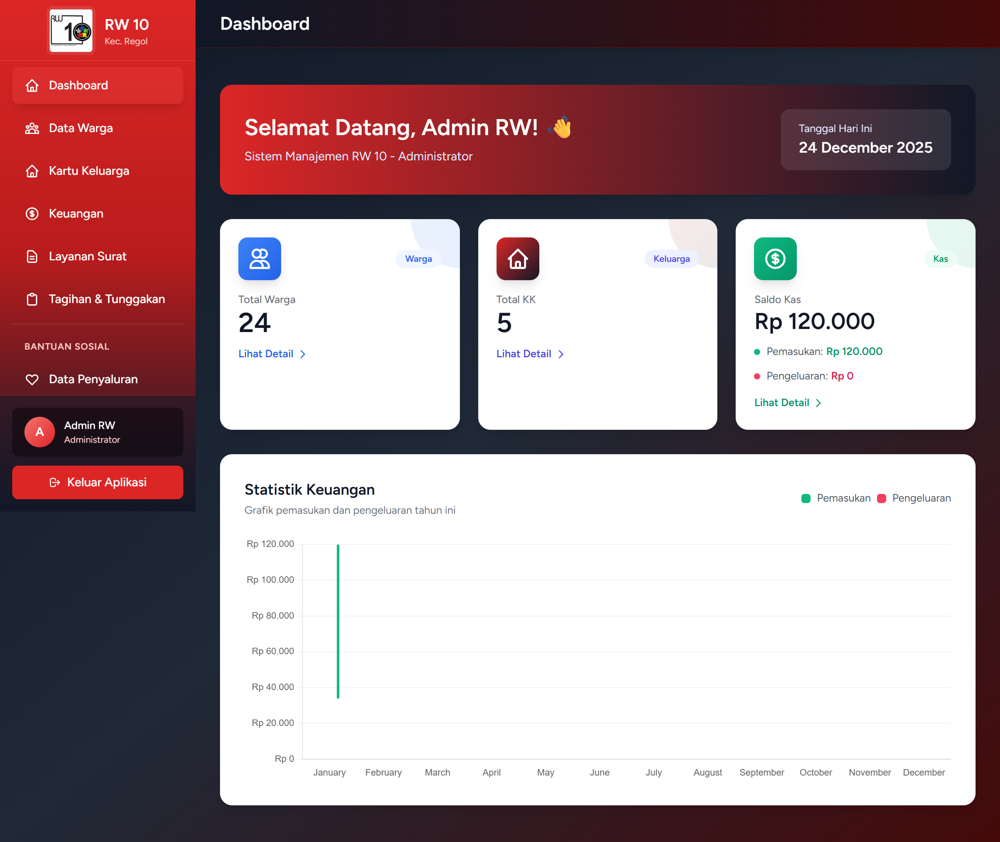

#### 2. Manajemen Kependudukan
**Data Warga**: Pencatatan lengkap data penduduk.
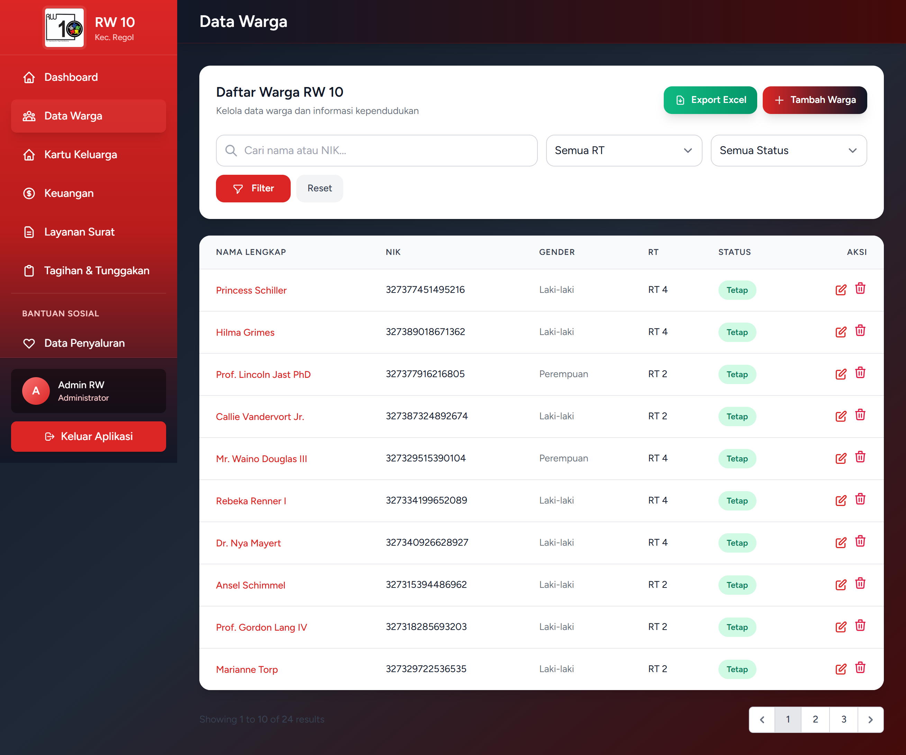

**Data Kartu Keluarga**: Daftar kepala keluarga dan anggotanya.
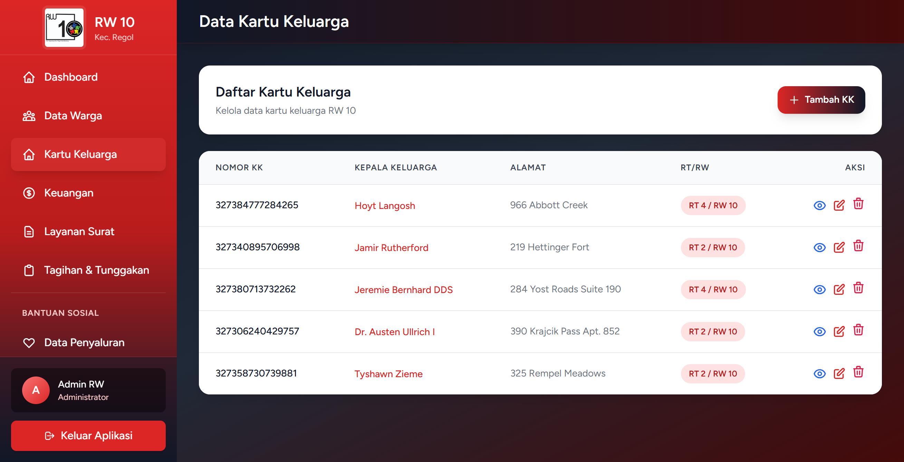

**Detail Kartu Keluarga**: Tampilan detail anggota keluarga dalam satu KK.
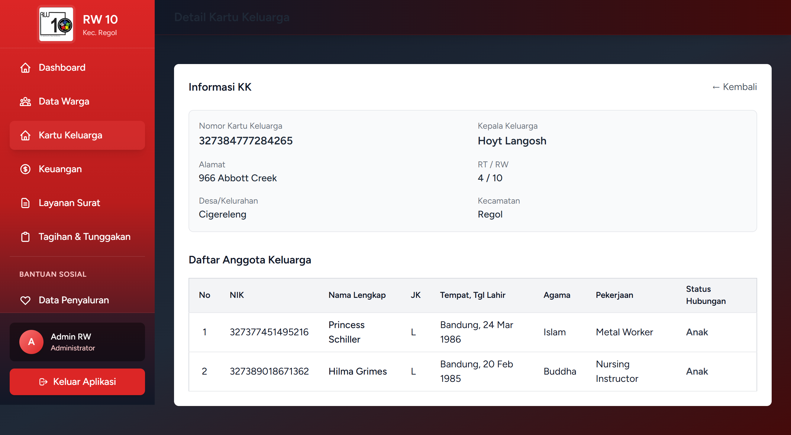

**Mutasi Warga**: Pencatatan warga pindah datang/keluar atau meninggal.
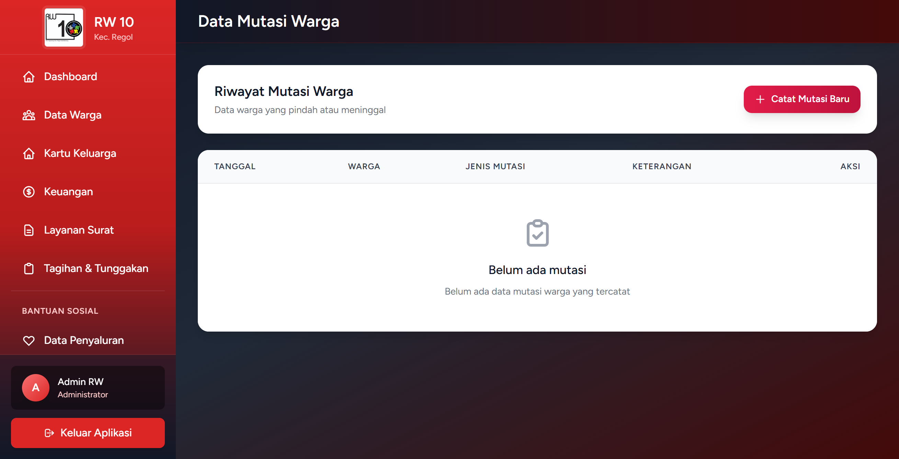

#### 3. Manajemen Keuangan
**Daftar Transaksi**: Pencatatan pemasukan dan pengeluaran kas RW.
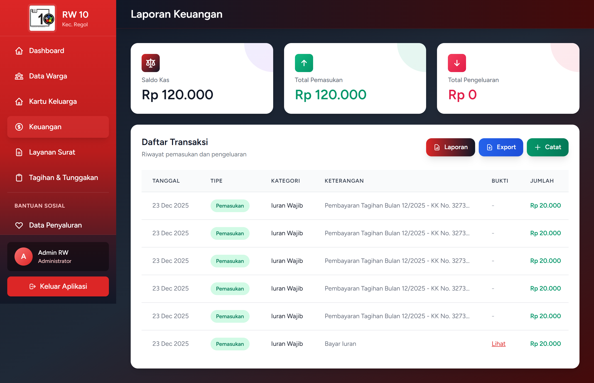

**Laporan Keuangan**: Rekapitulasi keuangan yang dapat dicetak atau diekspor.
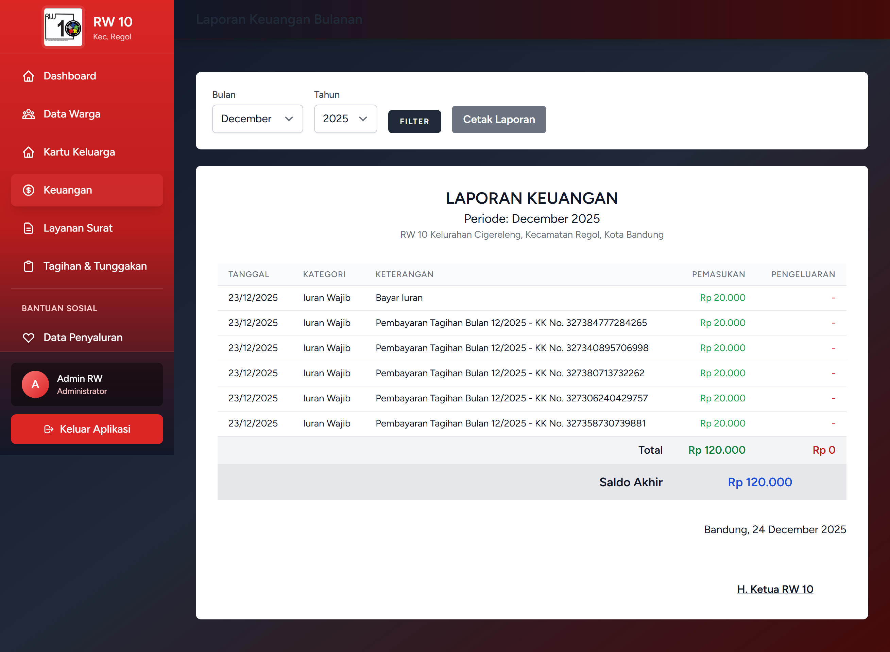

**Kategori Transaksi**: Pengaturan pos-pos anggaran keuangan.
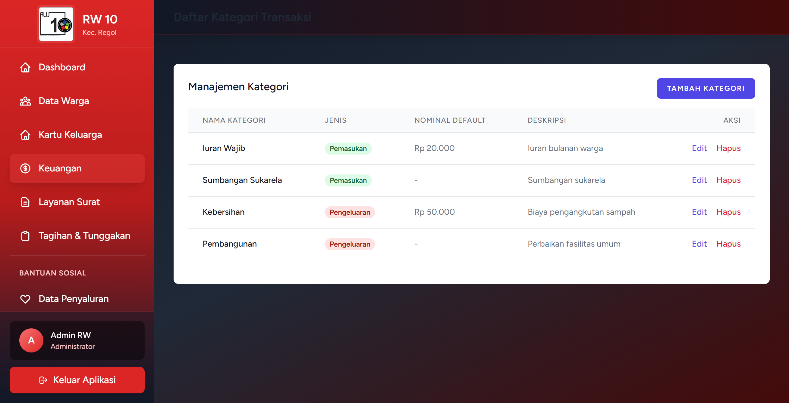

#### 4. Tagihan & Iuran
Manajemen tagihan iuran warga dan status pembayarannya.
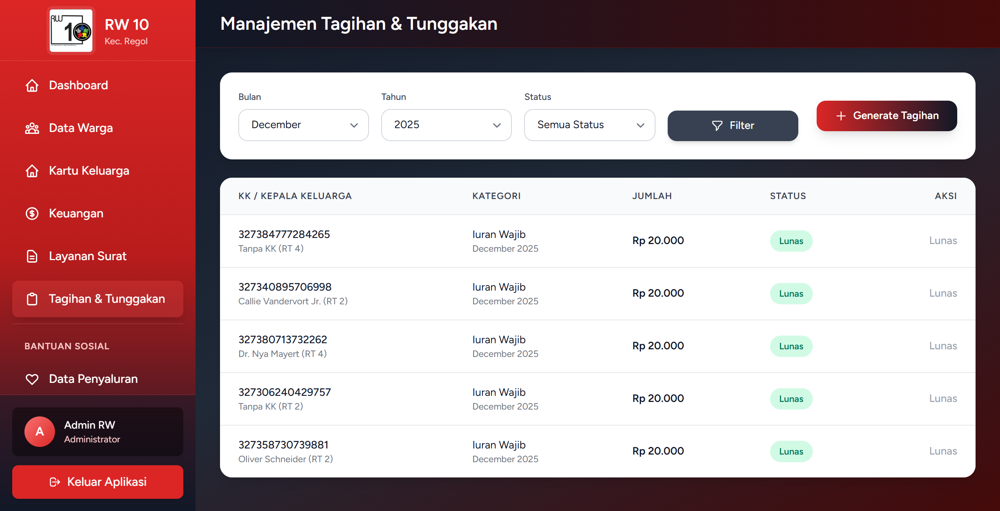

#### 5. Layanan Surat
Fitur pembuatan surat pengantar otomatis untuk kebutuhan warga (KTP, KK, SKCK, dll).
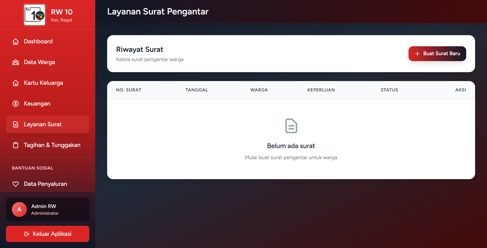

#### 6. Bantuan Sosial (Bansos)
**Program Bansos**: Daftar program bantuan yang tersedia.

**Penerima Bansos**: Data warga yang menerima bantuan pada setiap program.
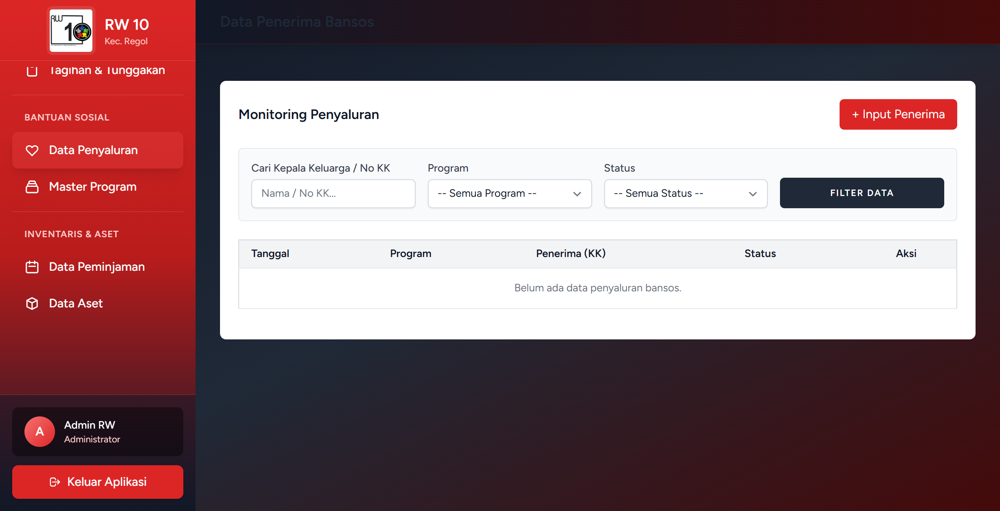

#### 7. Inventaris Barang
**Data Aset**: Daftar barang inventaris milik RW.
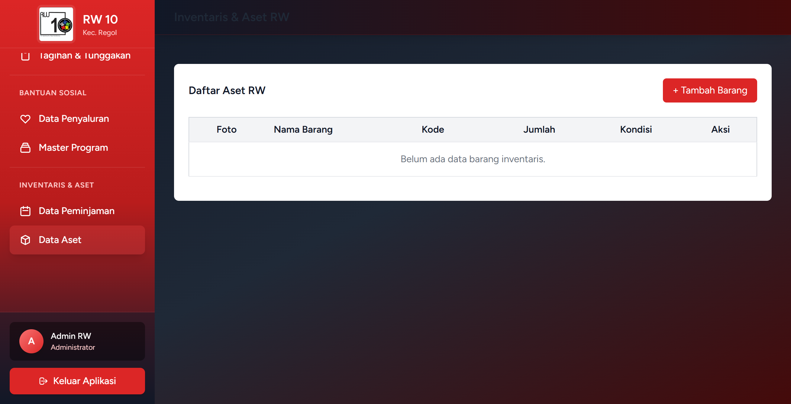

**Peminjaman Barang**: Pencatatan peminjaman barang oleh warga.

#### 8. Pengaturan Sistem
**Manajemen User**: Pengaturan akun untuk Admin dan Pengurus RT.
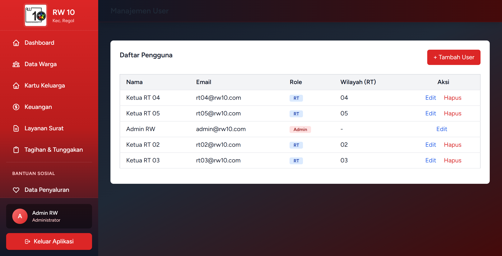

---

## Teknologi

Aplikasi ini dibangun menggunakan:
-   **Framework**: Laravel 12
-   **Database**: PostgreSQL / MySQL
-   **Frontend**: Tailwind CSS, Blade Templates, Alpine.js
-   **Server**: Apache / Nginx

## Instalasi

1.  Clone repository ini via Git.
2.  Jalankan `composer install`
3.  Jalankan `npm install && npm run dev`
4.  Copy `.env.example` ke `.env` dan konfigurasi database.
5.  Jalankan `php artisan key:generate`
6.  Jalankan `php artisan migrate --seed`
7.  Jalankan `php artisan serve`

---
&copy; 2025 RW 10 Management System.
